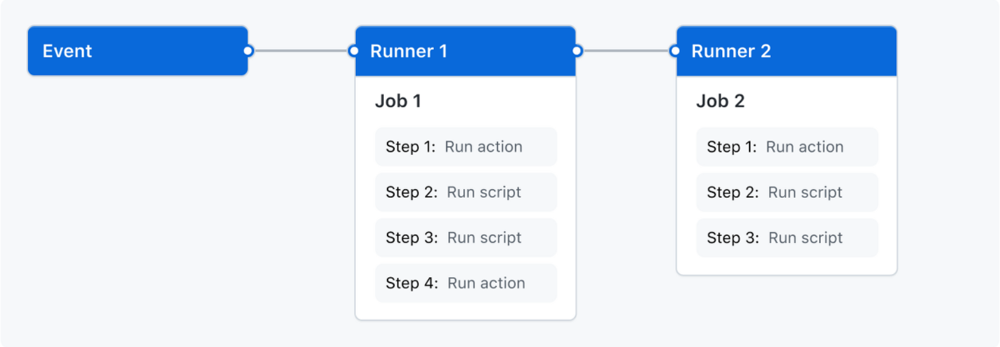
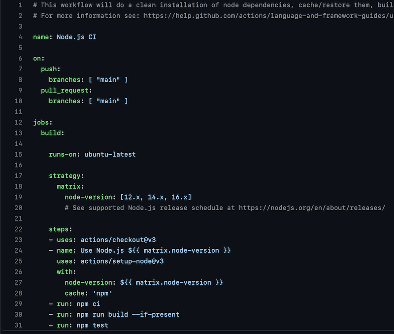
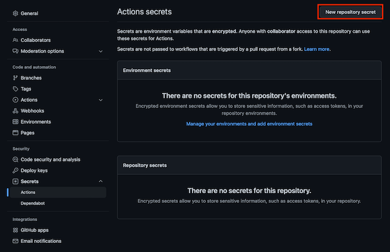
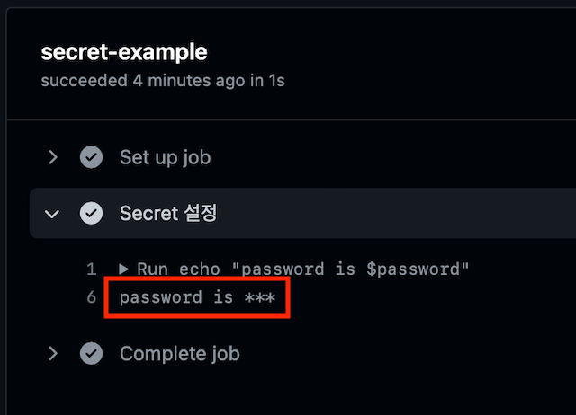

# Github Action Test
생활코딩 강의 참고

---

## 개요
### 1. 사용 이유
- 원격 레포지토리에 소스를 푸시하고 서버에 다시 배포하는 과정을 자동화로 만들 수 있음
- 테스트 코드 자동 실행
- 쉘 스크립트 작성 후 조건 발생 시 실행

### 2. CI / CD
- 지속적인 통합(Continuous Integration)과 지속적인 배포(Continuous Deployment)
- 어플리케이션 개발 단계를 자동화해 보다 짧은 주기로 통합 및 배포
- 여러 개발자가 동시에 작업하며 발생할 수 있는 충돌 문제를 수시로 확인하고 해결 가능

<br>

## 프로세스
Event - Runner - Job - Step



### 1. Workflow
- 하나 이상의 Job으로 구성되고, Event에 의해 트리거 될 수 있도록 자동화된 프로세스
- 가장 최상위 개념으로 YAML로 작성
- 한 개의 레포지토리는 여러 Workflow를 가질 수 있고, 서로 다른 작업 수행 가능

### 2. Event
- Workflow 실행을 트리거하는 특정 활동이나 규칙
- Pull Request를 특정 브랜치로 Push 했을 때 실행 가능

### 3. Runner
- Workflow가 트리거될 때 실행되는 서버(가상머신)
- Github에서 호스팅하는 서비스와 직접 호스팅하는 서비스로 실행

### 4. Job
- 여러 Step으로 구성되고 가상 환경의 인스턴스에서 실행
- 하나의 컨테이너

### 5. Step
- task들의 집합으로 실질적으로 명령어를 입력하거나 쉘 스크립트를 실행할 수 있음

<br>

## Workflow 구성요소



### 1. name
- 레포지토리 작업 탭에 표시될 Workflow의 이름으로 작성하지 않아도 됨

### 2. on
- Workflow에 대한 트리거 지정
- 위 사진 기준으로 main 브랜치에 Pull Request를 보내거나 Push를 할 경우 트리거

### 3. jobs
- 실행되는 모든 Job을 그룹화

### 4. build
- 실행할 Job의 이름

### 5. runs-on
- 실행할 OS 지정

### 6. steps
- build라는 Job에서 실행되는 모든 Step을 그룹화
- 각 항목은 별도의 작업이거나 쉘 스크립트

#### 1) uses
- 현재 단계에서 actions/checkout@/v2를 실행
- **다른 사람이 만든 Workflow를 실행**
- 내 레포지토리를 runner에서 체크아웃해서 스크립트 또는 빌드 테스트 도구를 실행

#### 2) name
- Step의 이름

#### 3) run
- runner에서 명령어를 실행하도록 지시
- 환경 변수 설정 가능

<br>

## 기타
### 1. 민감 정보
- 비밀번호와 같은 민감 정보를 이용해 테스트를 하거나 배포할 경우
- Github의 secret으로 저장하여 환경 변수로 사용 가능



프로젝트 설정에서 시크릿 설정을 해준 뒤, 아래와 같이 테스트 코드를 작성하면 사용 가능

```yaml
secret-example:
  
  runs-on: ubuntu-20.04

  steps:
    - name: Secret 설정
      env:
        # 환경변수에 password 등록
        password: ${{ secrets.password }}
      run:
        echo "password is $password"
```

테스트 결과를 확인해보면 패스워드를 직접 보여주진 않는 것(보안)을 확인

